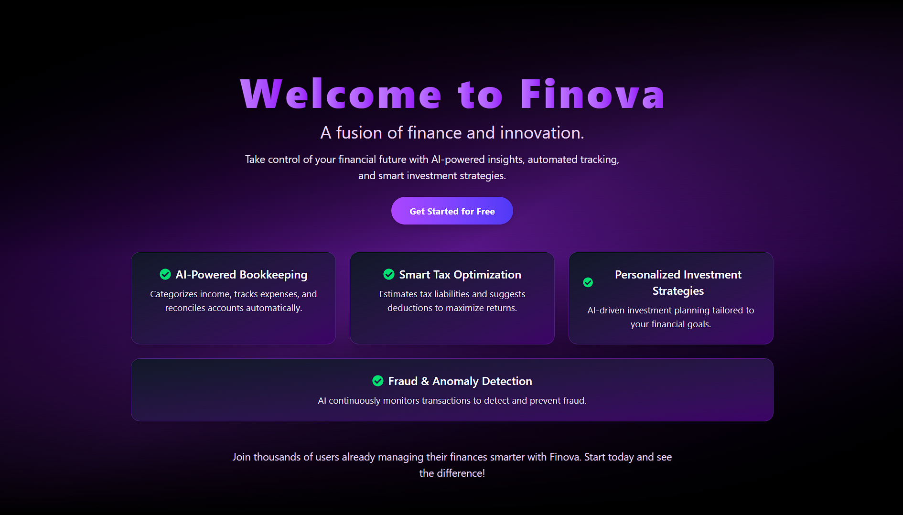

# 🌟 Finova - AI-Powered Personalized Accountant App 💰🤖

## 🚀 Overview



The **AI-Powered Personalized Accountant App** is a smart financial management system that helps users track their expenses, investments, and tax details with AI-driven insights. Built using the **MERN stack (MongoDB, Express, React, Node.js)**, this app provides a seamless and interactive experience for managing finances efficiently.

## ✨ Features

- 🔐 **User Authentication** (Login/Register with JWT) - Secure access with encrypted credentials and session management.
- 📊 **Dynamic Financial Dashboard** (Real-time updates without reloading) - View your financial data instantly with an intuitive and interactive UI.
- 🏦 **Bank Balance & Transactions Overview** - Monitor account balances, recent transactions, and spending trends in one place.
- 📈 **Investment & Goal Tracking** - Set financial goals and track investments with personalized insights.
- ⚠️ **Fraud Alerts & Security Insights** - AI-driven fraud detection system that notifies users of suspicious transactions.
- 🧾 **Tax Overview & Smart Recommendations** - Get AI-powered tax planning strategies and deductions to optimize savings.
- 🤖 **AI-Powered Chatbot for Financial Assistance** - 24/7 chatbot support for financial queries and budget management.
- 📅 **Calendar & Reminders for Bill Payments** - Never miss a due date with automated reminders and scheduling.
- 🌐 **Responsive UI with Interactive Components** - A seamless experience across devices with a modern and accessible design.

## 🛠️ Tech Stack

- 🎨 **Frontend:** React.js, Redux, Tailwind CSS
- 🖥️ **Backend:** Node.js, Express.js
- 🗄️ **Database:** MongoDB (Mongoose ORM)
- 🔑 **Authentication:** JWT (JSON Web Token)
- 🧠 **AI/ML Integration:** OpenAI API / TensorFlow\.js (for fraud detection & tax recommendations)
- 🚀 **Deployment:** Vercel (Frontend), Render/Heroku (Backend), MongoDB Atlas

## ⚡ Installation & Setup

### 1️⃣ Clone the Repository

```sh
git clone https://github.com/your-username/Finova.git
cd Finova
```

### 2️⃣ Install Dependencies

#### Backend:

```sh
npm install
```

#### Frontend:

```sh
npm install
```

### 3️⃣ Configure Environment Variables

Create a `.env` file in the `server` folder:

```
MONGO_URI=your_mongodb_connection_string
JWT_SECRET=your_jwt_secret
OPENAI_API_KEY=your_openai_api_key
```

### 4️⃣ Run the Application

#### 🎨 Start Frontend:

```sh
npm run dev
```

#### 🚀 Start Backend Server:

```sh
npm start
```

## 🎯 Future Enhancements

- 🔮 **AI-powered Expense Predictions**
- 💱 **Multi-currency Support**
- 🏦 **Integration with Banking APIs**
- 🌙 **Dark Mode & UI Enhancements**

## 🤝 Contributing

We welcome contributions! Feel free to fork this repository, raise issues, and submit PRs. 🚀

## 📜 License

This project is open-source and licensed under the **MIT License**.

---

### 💡 Developed by [Your Name] ✨

